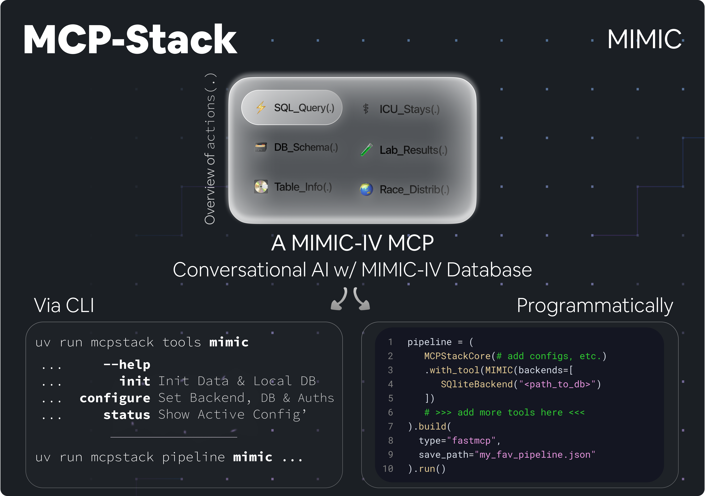

<!--suppress HtmlDeprecatedAttribute -->
<div align="center">
  <h1 align="center">
    <br>
    <a href="#"></a>
    <br>
    MCPStack Tool Builder
    <br>
  </h1>
  <h4 align="center">A Template To Fasten The Creation of MCP-Stack MCP Tools</h4>
</div>

<div align="center">

<a href="https://pre-commit.com/">
  
</a>


</div>

> [!IMPORTANT]
> If you have not been across the MCPStack main orchestrator repository, please start
> there: [View Org](https://github.com/MCP-Pipeline)

# Want To Improve This Template?

Hey there! Appreciated your venue here! Want to build stuff on top of `MCPStack-Tool-Builder`?

## Prerequisites

- Python 3.9+
- [uv](https://docs.astral.sh/uv/) (preferred package/dependency manager)
- `pre-commit` and `ruff`
- Git (with your GitHub SSH set up if you push to a fork)

## Setup

Clone the repository and sync dependencies:

```bash
git clone https://github.com/MCP-Pipeline/MCPStack-Tool-Builder.git
cd MCPStack-Tool-Builder
uv sync --all-extras
uv run pre-commit install

# uv automatically installs in editable mode.
# To manage dependencies:

uv add <package>      # add a package
uv remove <package>   # remove a package
uv lock               # update lockfile
```

See the uv documentation for installation instructions.

Branches & Commits
* Branch from main: feat/<slug>, fix/<slug>, chore/<slug>. 
* Keep commits focused and descriptive. Conventional commits are welcome: feat:, fix:, chore:, docs:.

Code Style
* Ruff is the source of truth for linting and formatting (ruff + ruff format).
* Line length: 100 (pyproject.toml).
* Prefer readable code over clever code. Add comments if intent isn’t obvious.

Tests
* Add tests for behavior changes. Minimal repro-style tests are acceptable.
* Keep test data lightweight and local.

Running Checks

```bash
uv run pre-commit run --all-files
```

PR Expectations
* Fill out the PR template (if present).
* Link to the issue you’re fixing.
* Include logs or minimal repros when relevant.
* Keep diffs reviewable. Split large changes into smaller PRs.

Security
* Never commit secrets or datasets.
* Do not upload datasets to GitHub issues or pull requests. Use synthetic or anonymized examples when reporting bugs.
* Report vulnerabilities privately first when possible.

Thanks for contributing!
